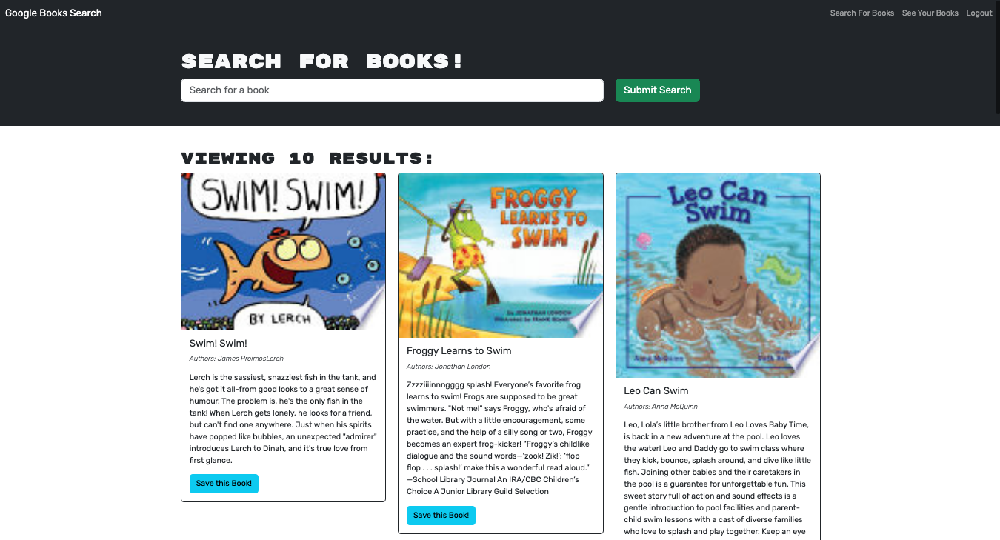

# APBookSearchEngine

Welcome to AP Book Search Engine! This application is a functioning book search application utilizing Google Books API. Users can set up an account, search for books and save their favorites to their account profile.

## Technology

This application features the following technologies:

* Built using the MERN stack with a React font end, MongoDB database, and Node.js/Express.js server and API.
* Utilized a GraphQL API build with Apollow Server.

## User experience

Users can anticipate the following functionality when using the application:

* When loading the search engine they are presented with options to search for books and login/signup.
* When entering a search term and clicking "submit" they are presented with several results of books with title, author, description, and image.
* When a user clicks on the login/signup option they are presented with a modal to either login or sign up.
* When a user toggles to signup they are presented with three inputs for username, email address, and password.
* When they enter their information and submit they are logged in to the application.
* When they are logged in to the application the navigation changes "Search For Books", "See Your Books", and "Logout".
* When logged in and searching books they are presented with the option to save books to their profile.
* When logged in they can choose the "See Your Books" option, and are taken to a page where they can see any books they have saved with the option to remove them.
* When they choose the "Logout" option they are logged out of the application.
* When they return to the application they can login with their saved email and password.

## Screenshot

## Link to Deployed Application

[Here is a link to the deployed application!](https://mighty-spire-42630-c6b4dc5261c2.herokuapp.com/)